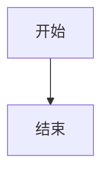

# MD-Mermaid-Static

一个命令行工具，用于将 Markdown 文件中的 Mermaid 图表转换为静态图片。

## 功能特点

- 支持解析 Markdown 文件中的 Mermaid 代码块
- 支持 YAML frontmatter 配置
- 支持多种图表主题和样式定制
- 支持多种输出格式（SVG、PNG、PDF）
- 支持并发渲染以加速处理
- 完整支持 mermaid-cli 参数传递
- 友好的命令行界面和进度显示

## 安装

确保你的系统已安装 Python 3.8 或更高版本，并且安装了 Node.js 环境。

```bash
pip install md-mermaid-static
```

## 使用方法

### 基本用法

```bash
md-mermaid-static input.md -o output_dir
```

### 指定输出格式

```bash
# 输出 SVG 格式
md-mermaid-static input.md -o output_dir -e svg

# 输出 PNG 格式
md-mermaid-static input.md -o output_dir -e png

# 输出 PDF 格式
md-mermaid-static input.md -o output_dir -e pdf
```

### 使用不同主题

```bash
md-mermaid-static input.md -o output_dir -t forest
```

### 设置图表尺寸和背景颜色

```bash
md-mermaid-static input.md -o output_dir -w 1200 -H 900 -b "#f0f0f0"
```

### 并发处理加速

```bash
# 开启并发处理
md-mermaid-static input.md -o output_dir -p

# 指定最大工作进程数
md-mermaid-static input.md -o output_dir -p -j 8
```

### 使用自定义配置和样式

```bash
# 使用自定义配置文件
md-mermaid-static input.md -o output_dir -c my_config.json

# 使用自定义 CSS 文件
md-mermaid-static input.md -o output_dir -C my_style.css
```

## 所有命令行选项

```
选项:
  --output-dir, -o TEXT           输出目录路径
  --output-format, -e [svg|png|pdf]
                                  输出图片格式
  --theme, -t [default|forest|dark|neutral]
                                  Mermaid 主题
  --width, -w INTEGER             图表宽度（像素）
  --height, -H INTEGER            图表高度（像素）
  --background-color, -b TEXT     背景颜色
  --scale, -s FLOAT               缩放比例
  --config-file, -c PATH          Mermaid JSON配置文件路径
  --css-file, -C PATH             自定义CSS文件路径
  --pdf-fit, -f                   将PDF缩放到适合图表大小
  --concurrent, -p                启用并发渲染以加速处理
  --max-workers, -j INTEGER       并发渲染的最大工作进程数
  --help                          显示帮助信息并退出
```

### Mermaid 代码块配置

在 Mermaid 代码块中，你可以添加 YAML frontmatter 来配置单个图表的渲染选项：

```markdown

```

## 主题配置

主题文件夹结构：

```
themes/
  └── theme_name/
      ├── config.json
      └── style.css
```

## 依赖

- click
- pydantic
- rich
- pyyaml
- pymupdf
- @mermaid-js/mermaid-cli (需要 Node.js 环境)

## 许可证

MIT
