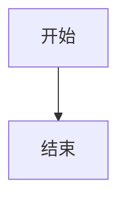

# MD-Mermaid-Static

一个命令行工具，用于将 Markdown 文件中的 Mermaid 图表转换为静态图片。

## 功能特点

- 支持解析 Markdown 文件中的 Mermaid 代码块
- 支持 YAML frontmatter 配置
- 支持自定义主题
- 支持 SVG 质量增强（通过 PDF 转换）
- 友好的命令行界面和进度显示

## 安装

确保你的系统已安装 Python 3.8 或更高版本。

```bash
pip install md-mermaid-static
```

## 使用方法

基本用法：

```bash
md-mermaid-static input.md -o output_dir
```

使用 SVG 质量增强：

```bash
md-mermaid-static input.md -o output_dir --enhance-svg
```

### Mermaid 代码块配置

在 Mermaid 代码块中，你可以添加 YAML frontmatter 来配置渲染选项：

```markdown

```

### 主题配置

主题文件夹结构：

```
themes/
  └── theme_name/
      ├── config.json
      └── style.css
```

## 依赖

- click
- pydantic
- rich
- pyyaml
- pymupdf
- @mermaid-js/mermaid-cli (需要 Node.js 环境)

## 许可证

MIT
