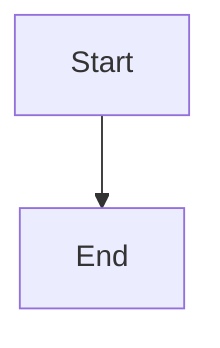

# MD-Mermaid-Static

[](https://opensource.org/licenses/MIT)
[](https://github.com/zenor0/md-mermaid-static/issues)

A tool for converting Mermaid diagrams in Markdown files to static images.

Initially designed to solve the problem of Typst not properly rendering text in SVG files exported by Mermaid.

*[中文文档](README_zh.md)*

## ✨ Features

- 🔍 Parse Mermaid code blocks in Markdown files
- ⚙️ Support YAML frontmatter configuration to set diagram names and other custom settings
- 🎨 Support multiple diagram themes and style customization
- 🖼️ Support various output formats (SVG, PNG, PDF)
- ⚡ Support concurrent rendering for faster processing
- 🔧 Complete support for mermaid-cli parameter passing
- 🖥️ User-friendly command line interface with progress display

## 📋 Table of Contents

- [Installation](#-installation)
- [Prerequisites](#-prerequisites)
- [Usage](#-usage)
- [Command Line Options](#-command-line-options)
- [Mermaid Code Block Configuration](#-mermaid-code-block-configuration)
- [Theme Configuration](#-theme-configuration)
- [Contributing](#-contributing)
- [License](#-license)

## 📥 Installation

> ![note]
> 
> The project is not yet published on PyPI and can only be installed locally from source.

```bash
# Install from source
git clone https://github.com/zenor0/md-mermaid-static.git
cd md-mermaid-static
pip install -e .
```

## 🔧 Prerequisites

> ![note]
> 
> The program has been developed and tested on Ubuntu 22.04 (WSL) and has not been tested in a Windows environment. If you encounter any issues, please submit an [Issue](https://github.com/zenor0/md-mermaid-static/issues).

Before running, make sure that `pnpm` or `npm` is installed on your system, as the JavaScript runtime is needed to render Mermaid diagrams.

### Installing dependencies with uv

```bash
uv sync
```

### Installing with pip

```bash
pip install -e .
```

## 🚀 Usage

### Basic Usage

```bash
md-mermaid-static input.md -o output_dir
```

### Specifying Output Format

```bash
# Output SVG format
md-mermaid-static input.md -o output_dir -e svg

# Output PNG format
md-mermaid-static input.md -o output_dir -e png

# Output PDF format
md-mermaid-static input.md -o output_dir -e pdf
```

### Using Different Themes

```bash
md-mermaid-static input.md -o output_dir -t forest
```

### Setting Diagram Size and Background Color

```bash
md-mermaid-static input.md -o output_dir -w 1200 -H 900 -b "#f0f0f0"
```

### Concurrent Processing to Speed Up

```bash
# Enable concurrent processing
md-mermaid-static input.md -o output_dir -p

# Specify maximum number of worker processes
md-mermaid-static input.md -o output_dir -p -j 8
```

### Using Custom Configuration and Styles

```bash
# Use custom configuration file
md-mermaid-static input.md -o output_dir -c my_config.json

# Use custom CSS file
md-mermaid-static input.md -o output_dir -C my_style.css
```

## 📝 Command Line Options

```
Options:
  --output-dir, -o TEXT           Output directory path
  --output-format, -e [svg|png|pdf]
                                  Output image format
  --theme, -t [default|forest|dark|neutral]
                                  Mermaid theme
  --width, -w INTEGER             Diagram width (pixels)
  --height, -H INTEGER            Diagram height (pixels)
  --background-color, -b TEXT     Background color
  --scale, -s FLOAT               Scale factor
  --config-file, -c PATH          Path to Mermaid JSON configuration file
  --css-file, -C PATH             Path to custom CSS file
  --pdf-fit, -f                   Scale PDF to fit diagram size
  --concurrent, -p                Enable concurrent rendering for faster processing
  --max-workers, -j INTEGER       Maximum number of worker processes for concurrent rendering
  --help                          Show help message and exit
```

## 📊 Mermaid Code Block Configuration

In Mermaid code blocks within Markdown files, you can add YAML frontmatter to configure rendering options for individual diagrams:

```markdown

```

## 🎨 Theme Configuration

Theme folder structure:

```
themes/
  └── theme_name/
      ├── config.json
      └── style.css
```

## 🤝 Contributing

Contributions to the project are welcome! Here are some ways you can contribute:

1. Submit bug reports or feature requests
2. Submit pull requests to fix issues or add new functionality
3. Improve documentation or add examples
4. Share the project with others

## 📄 License

This project is licensed under the [MIT License](LICENSE)

