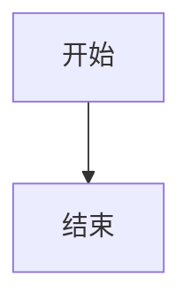

# MD-Mermaid-Static

[](https://opensource.org/licenses/MIT)
[](https://github.com/zenor0/md-mermaid-static/issues)

将 Markdown 文件中的 Mermaid 图表转换为静态图片的工具。

设计之初，是为了解决 Powerpoint/Typst 不能正确渲染 Mermaid 默认导出的 SVG 中的文字部分的问题。

## ✨ 功能特点

- 🔍 解析 Markdown 文件中的 Mermaid 代码块
- ⚙️ 支持 YAML frontmatter 配置，可设定图表名称和其他自定义设置
- 🎨 支持多种图表主题和样式定制
- 🖼️ 支持多种输出格式（SVG、PNG、PDF）
- ⚡ 支持并发渲染以加速处理
- 🔧 完整支持 mermaid-cli 参数传递
- 🖥️ 友好的命令行界面和进度显示

## 📋 目录

- [安装](#-安装)
- [前提条件](#-前提条件)
- [使用方法](#-使用方法)
- [命令行选项](#-命令行选项)
- [Mermaid 代码块配置](#-mermaid-代码块配置)
- [主题配置](#-主题配置)
- [贡献指南](#-贡献指南)
- [许可证](#-许可证)

## 📥 安装

> **注意**
> 
> 项目暂未发布到 PyPI，目前只支持从源码本地安装。

```bash
# 从源码安装
git clone https://github.com/zenor0/md-mermaid-static.git
cd md-mermaid-static
pip install -e .
```

## 🔧 前提条件

> **注意**
> 
> 程序在 Ubuntu 22.04（WSL）下测试开发，未在 Windows 环境下进行测试。若有问题请提 [Issue](https://github.com/zenor0/md-mermaid-static/issues) 反馈。

执行前请确保系统安装了 `pnpm` 或 `npm`，渲染 Mermaid 需要用到 JavaScript 运行时。

### 使用 uv 安装依赖

```bash
uv sync
```

### 使用 pip 安装

```bash
pip install -e .
```

## 🚀 使用方法

### 基本用法

```bash
md-mermaid-static input.md -o output_dir
```

### 指定输出格式

```bash
# 输出 SVG 格式
md-mermaid-static input.md -o output_dir -e svg

# 输出 PNG 格式
md-mermaid-static input.md -o output_dir -e png

# 输出 PDF 格式
md-mermaid-static input.md -o output_dir -e pdf
```

### 使用不同主题

```bash
md-mermaid-static input.md -o output_dir -t forest
```

### 设置图表尺寸和背景颜色

```bash
md-mermaid-static input.md -o output_dir -w 1200 -H 900 -b "#f0f0f0"
```

### 并发处理加速

```bash
# 开启并发处理
md-mermaid-static input.md -o output_dir -p

# 指定最大工作进程数
md-mermaid-static input.md -o output_dir -p -j 8
```

### 使用自定义配置和样式

```bash
# 使用自定义配置文件
md-mermaid-static input.md -o output_dir -c my_config.json

# 使用自定义 CSS 文件
md-mermaid-static input.md -o output_dir -C my_style.css
```

## 📝 命令行选项

```
选项:
  --output-dir, -o TEXT           输出目录路径
  --output-format, -e [svg|png|pdf]
                                  输出图片格式
  --theme, -t [default|forest|dark|neutral]
                                  Mermaid 主题
  --width, -w INTEGER             图表宽度（像素）
  --height, -H INTEGER            图表高度（像素）
  --background-color, -b TEXT     背景颜色
  --scale, -s FLOAT               缩放比例
  --config-file, -c PATH          Mermaid JSON配置文件路径
  --css-file, -C PATH             自定义CSS文件路径
  --pdf-fit, -f                   将PDF缩放到适合图表大小
  --concurrent, -p                启用并发渲染以加速处理
  --max-workers, -j INTEGER       并发渲染的最大工作进程数
  --help                          显示帮助信息并退出
```

## 📊 Mermaid 代码块配置

在 Markdown 文件中的 Mermaid 代码块中，你可以添加 YAML frontmatter 来配置单个图表的渲染选项：

````markdown

````

## 🎨 主题配置

主题文件夹结构：

```
themes/
  └── theme_name/
      ├── config.json
      └── style.css
```

## 🤝 贡献指南

欢迎对项目进行贡献！以下是几种参与方式：

1. 提交 Bug 报告或功能请求
2. 提交 Pull Request 修复问题或添加功能
3. 改进文档或添加示例
4. 分享项目给其他人

## 📄 许可证

该项目采用 [MIT 许可证](LICENSE) 