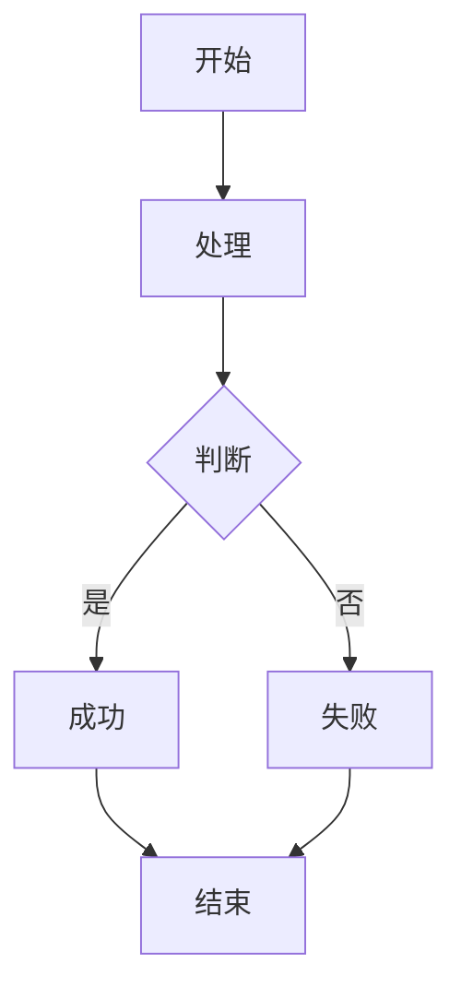
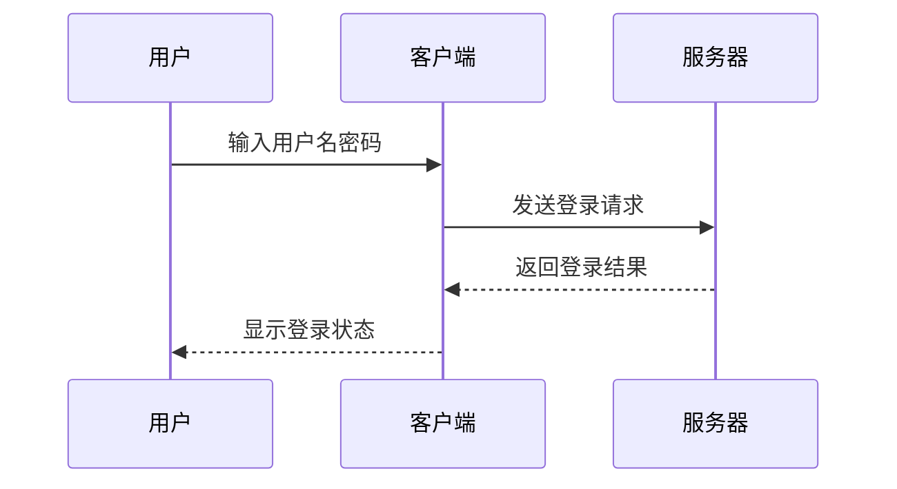
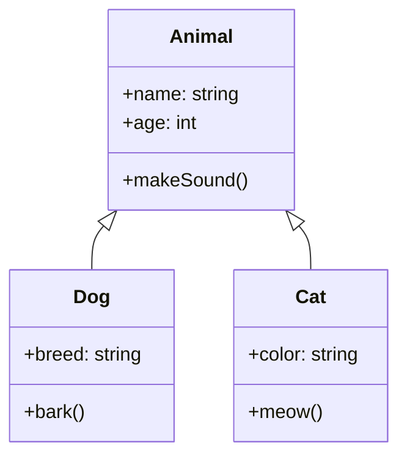

# Mermaid 图表示例

这个文档包含了几个不同类型的 Mermaid 图表示例。

## 1. 流程图

```mermaid
---
caption: 简单流程图示例
render-theme: default
---
graph TD
    A[开始] --> B[处理]
    B --> C{判断}
    C -->|是| D[成功]
    C -->|否| E[失败]
    D --> F[结束]
    E --> F
```

## 2. 时序图

```mermaid
---
caption: 用户登录时序图
render-theme: dark
---
sequenceDiagram
    participant U as 用户
    participant C as 客户端
    participant S as 服务器
    
    U->>C: 输入用户名密码
    C->>S: 发送登录请求
    S-->>C: 返回登录结果
    C-->>U: 显示登录状态
```

## 3. 类图

```mermaid
---
caption: 简单类图示例
---
classDiagram
    class Animal {
        +name: string
        +age: int
        +makeSound()
    }
    class Dog {
        +breed: string
        +bark()
    }
    class Cat {
        +color: string
        +meow()
    }
    Animal <|-- Dog
    Animal <|-- Cat
``` 