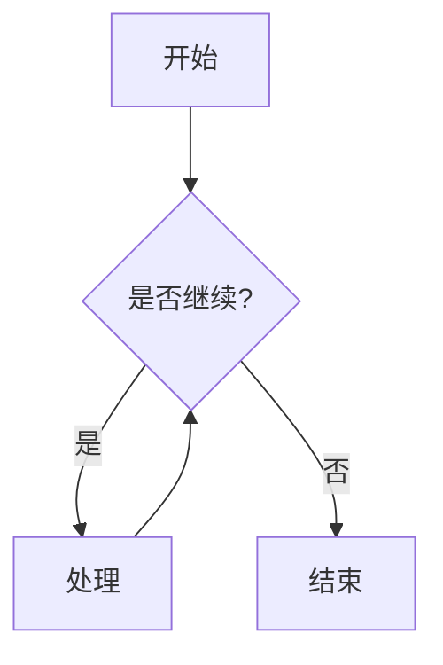

# Mermaid 主题系统

本目录包含了自定义主题的集合。主题系统允许用户创建自己的主题，并在Markdown文件中使用。

## 主题目录结构

每个主题都是一个独立的文件夹，文件夹名称即为主题名称。每个主题文件夹应包含以下文件：

- `theme.json`：Mermaid主题配置文件，定义了主题的颜色和样式变量
- `style.css`：自定义CSS样式文件，用于进一步自定义图表的外观
- `flowchart_preview.svg`：流程图预览图像（由预览脚本生成）
- `sequence_preview.svg`：序列图预览图像（由预览脚本生成）
- `class_preview.svg`：类图预览图像（由预览脚本生成）
- `preview.html`：包含所有预览的HTML文件（由预览脚本生成）

## 使用自定义主题

在Markdown文件中，可以通过在Mermaid代码块的前置元数据中指定`render-theme`来使用自定义主题：

```markdown

```

## 通过CLI指定主题目录

可以通过`--themes-dir`参数指定自定义主题的目录：

```bash
md-mermaid-static examples/theme-test.md --themes-dir themes
```

这样，程序会在`themes`目录中查找主题文件夹。

## 可用主题

本目录包含以下主题：

### 示例主题
- `example-theme`：基本示例主题，用于演示主题系统的工作原理

### 颜色主题
- `deep-sea-blue`：深海蓝调主题，使用深蓝色调和水波纹效果
- `sunset-glow`：日落余晖主题，使用温暖的橙色和黄色调
- `minty-fresh`：薄荷清新主题，使用清新的绿色和柔和的色调
- `charcoal-tech`：炭黑科技主题，使用深色背景和青色高亮
- `purple-dream`：紫色梦境主题，使用梦幻的紫色调和星星效果
- `retro-computing`：复古计算机主题，模拟老式终端显示器的外观
- `oceanic-blues`：海洋蓝色主题，使用蓝色调和水波纹效果

### 手绘风格主题
- `hand-drawn-sketch`：手绘素描风格，使用黑白色调和素描线条效果
- `hand-drawn-colorful`：手绘彩色风格，使用多彩的颜色和不规则的线条
- `hand-drawn-chalk`：粉笔板风格，模拟黑板和粉笔的效果
- `hand-drawn-comic`：卡通漫画风格，使用明亮的颜色和漫画对话框效果

## 创建自己的主题

要创建自己的主题，只需创建一个新的文件夹，并添加`theme.json`和`style.css`文件。可以参考示例主题的文件结构和内容。

### theme.json 格式

```json
{
  "theme": "base",
  "themeVariables": {
    "primaryColor": "#颜色代码",
    "primaryTextColor": "#颜色代码",
    "lineColor": "#颜色代码",
    // 其他颜色变量...
  }
}
```

### 添加手绘风格

要创建手绘风格的主题，在theme.json中添加`"look": "handDrawn"`：

```json
{
  "theme": "base",
  "look": "handDrawn",
  "themeVariables": {
    // 颜色变量...
  }
}
```

### style.css 格式

```css
/* 主题名称 CSS */
.mermaid {
  font-family: '字体名称', sans-serif;
}

/* 节点样式 */
.node rect, .node circle {
  /* 自定义样式 */
}

/* 其他样式... */
```

## 生成主题预览

可以使用预览生成脚本为所有主题生成预览图像：

```bash
python scripts/generate_theme_previews.py
```

这将在每个主题文件夹中生成预览图像和HTML预览文件。详细信息请参阅 `scripts/README.md`。 